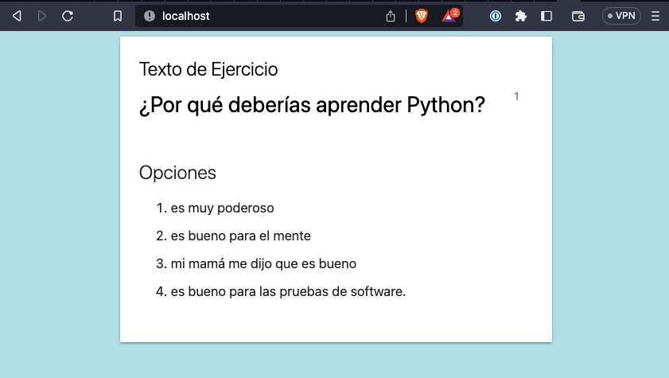

# Ejemplo de Pytest y Playwright y Flask

Este es un conjunto básico de pruebas utilizando pytest y playwright para testear una aplicación Flask que se ejecuta en un contenedor de Docker.

## Requisitos

* Docker
* Python 3.9.16
* Poetry (opcional)

## Instalación de las dependencias localmente

## Usando Poetry

El contenedor de Docker utiliza Poetry para instalar las dependencias del proyecto. Puedes elegir instalarlas localmente usando Poetry, virtualenv o la herramienta de gestión de paquetes que desees.

Si eliges usar Poetry, puedes navegar al directorio del proyecto y instalar las dependencias.

```
cd ./backend/app
poetry install --no-root
poetry run playwright install chromium --with-deps
```

## Usando venv de Python

```
cd ./backend/app
python3 -m venv .venv
```

Asegúrate de tener activado tu virtualenv:

```
cd ./backend/app
source .venv/bin/activate
pip install -r requirements.txt
```

Instalación de Playwright:

```
playwright install chromium --with-deps
```

## Inicio rápido

Mientras estés en el directorio raíz del proyecto, inicia la aplicación de backend utilizando docker:

```
docker-compose up -d
```

Asegúrate de que la aplicación de backend esté ejecutándose abriendo `http://localhost` en tu navegador web.



Ejecuta las pruebas de extremo a extremo localmente utilizando Poetry:

```
cd ./backend/app
poetry run pytest --base-url http://localhost ./tests
```

Ejecuta las pruebas de extremo a extremo localmente utilizando venv:

```
cd ./backend/app
source .venv/bin/activate
pytest --base-url http://localhost ./tests
```
