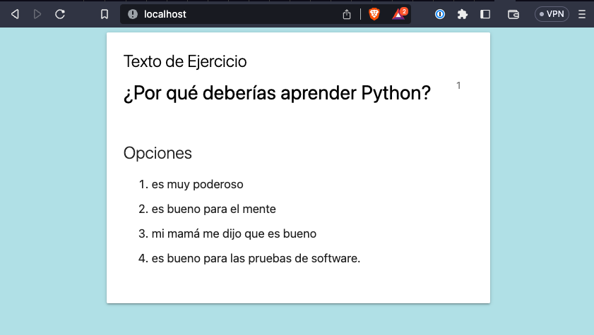

# Pytest Playwright Example

This is a very basic setup for pytest and playwright used to test a Flask application that is running in a docker container.

## Requirements

* Docker
* Python 3.9.16
* Poetry (optional)

## Install the dependencies locally

### Using poetry

The docker container uses Poetry to install the project dependences. You can choose to install them locally using poetry, virtualenv, 
or your desired package management tool.

If you choose to use Poetry then you can navigate to the project directory and install the dependencies.

```
cd ./backend/app
poetry install --no-root
poetry run playwright install chromium --with-deps
```

### Using Python's venv

```
cd ./backend/app
python3 -m venv .venv
```

Ensure you have your virtualenv activated:

```
cd ./backend/app
source .venv/bin/activate
```

Install dependencies and playwright:

```
pip install -r requirements.txt
playwright install chromium --with-deps
```


## Quick Start

While at the root directory of the project start backend application using docker:

```
docker-compose up -d
```

Ensure the backend app is running by opening `http://localhost` in your web browser.



Run the end to end tests locally using Poetry:

```
cd ./backend/app
poetry run pytest --base-url http://localhost ./tests
```

Run the end to end tests locally using venv:

```
cd ./backend/app
source .venv/bin/activate
pytest --base-url http://localhost ./tests
```
